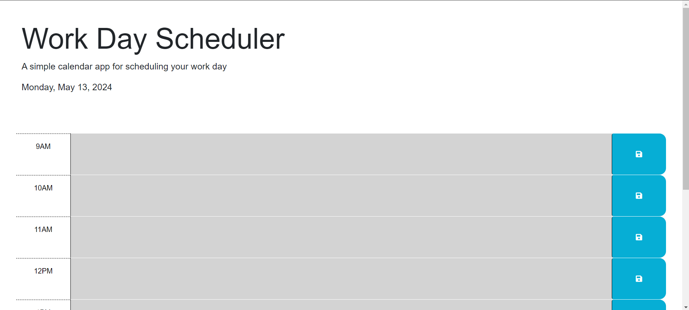

# Work Day Scheduler

A simple calendar application for scheduling your work day.

## Table of Contents

- [Example](#example)
- [Deployed](#Deployed)
- [Description](#description)
- [Features](#features)
- [Installation](#installation)
- [Usage](#usage)

## Example image

## Deployed application

link to deployed page [here](https://juanycorn.github.io/Workday_scheduler/)

## Description

This project is a work day scheduler that allows users to plan their daily tasks during standard business hours (9AM to 5PM). The application dynamically updates time blocks to indicate whether each hour is in the past, present, or future. Users can add events for each hour and save them locally, ensuring that their schedule persists even after refreshing the page.

## Features

- Displays the current date at the top of the calendar.
- Time blocks are color-coded to indicate whether they are in the past, present, or future.
- Users can click into a time block to enter an event.
- Events are saved in local storage when the user clicks the save button.
- Saved events persist even after refreshing the page.

## Installation

1. Clone the repository to your local machine:

2. Open the project directory.

3. Open `index.html` in your web browser.

## Usage

1. Upon opening the application, you will see time blocks for each hour of the work day (9AM to 5PM).
2. The current date is displayed at the top of the calendar.
3. Time blocks are color-coded: gray for past hours, red for the current hour, and green for future hours.
4. Click into a time block to enter an event for that hour.
5. Click the save button to save the event. The event will be stored locally and persist even after refreshing the page.
